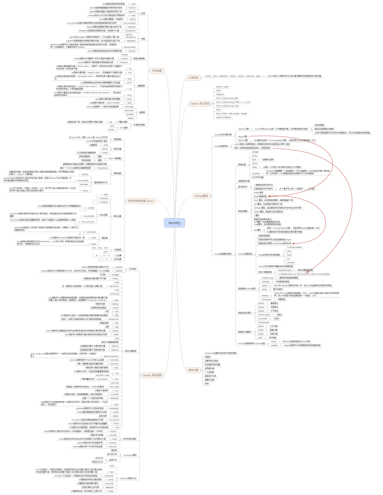

# 数据科学常用基础库

- [数据科学常用基础库](#数据科学常用基础库)
	- [Numpy](#Numpy)
	- [Pandas](#Pandas)
	- [Scipy](#Scipy)
	- [Matplotlib](#Matplotlib)

## Numpy

Numpy 是Python的高性能科学计算基础库。

Numpy 参考
[numpy](https://github.com/donnemartin/data-science-ipython-notebooks#numpy)

Numpy 基础

## Pandas

Pandas是基于Numpy构建的搞性能数据统计库。它提供了Series、DataFrame、Panel三种数据结构。

| 数据结构 | 说明 |
|-------|---|
| Series | 一位维数组，带有标签作为索引。 |
| DataFrame | 二维数组，与 SQL 的表结构类似。可以理解为 Series 为 value 的 Map 数据结构。 |
| Panel  | 三维数组，可以理解为 DataFrame 为 value 的 Map 数据结构。 |
| Panel4D\PanelND | 已废弃 |

相关操作：
1. 数据创建
2. 数据查看
3. 数据选择
4. 数据设置
5. 缺失值处理
6. 汇总与统计
7. 类 SQL 操作
8. 时间序列
9. 文件I\O

参考
[pandas](https://github.com/donnemartin/data-science-ipython-notebooks#pandas)

## Scipy

Scipy 是一款高性能数学计算函数库，包含常见的数学方法实现。
Scipy 根据不同的功能应用划分为不同的子模块，子模块之间基本是相互独立的。

| 模块 | 说明 |
|-------|---|
| scipy.cluster | 矢量量化、k-means、层次聚类 |
| scipy.constants | 物理与数学常数 |
| scipy.fftpack | 傅里叶变换 |
| scipy.interate | 积分程序 |
| scipy.interpolate | 插值 |
| scipy.io | 输入输出 |
| scipy.linalg | 线性代数 |
| scipy.ndimage | N 维数据包 |
| scipy.odr | 正交距离回归 |
| scipy.optimize | 优化 |
| scipy.signal | 信号处理 |
| scipy.sparse | 稀疏矩阵 |
| scipy.spatial | 空间数据结构和算法 |
| scipy.special | 特殊数学函数 |
| scipy.stats | 统计 |

## Matplotlib

Matplotlib 是绘制高质量2D图像的Python库。
1、面向过程作图
面向过程作图是指利用 pyplot 包提供的函数来逐步绘图。步骤如下：
1. 创建figure，类似于图纸
2. 创建坐标
3. 绘制图像
4. 调整刻度和标签、添加注释

2、面向过程作图
Matplotlib 提供了 Object Container 的概念，它有 Figure、Axes、Axis、Tick 四种类型的对象容器。

| 容器 | 说明 |
|-----|------|
| Figure | 负责图像大小、位置等操作 |
| Axes | 负责坐标系位置、绘图等操作 |
| Axis | 负责坐标抽的操作 |
| Tick | 负责刻度的相关操作 |

notes:
四种对象容器之间是层层包含的关系。

作图过程如下：
1. 实例化 Figure 对象
2. Figure 定位图像大小、位置，返回 Axes 对象
3. Axes 对象绘制图像，调整坐标抽位置，返回 Axis 对象
4. Axis 对象设置X、Y坐标的显示长度，刻度，标签等，返回 Tick 对象
5. Tick 对象格式化刻度的样式等

Matplotlib 参考
[matplotlib](https://github.com/donnemartin/data-science-ipython-notebooks#matplotlib)

Matplotlib 基础

